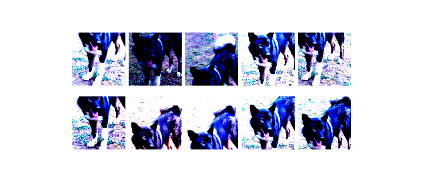
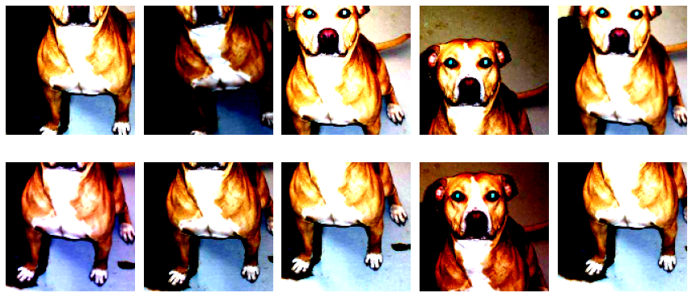

<!-- toc --> 
# EMLOPS Assignment 1
### Tasks
- Change the train.py file to work with PyTorch
- Repeat the whole tutorial (Links to an external site.) again, but this time committing to GitHub.
- your data MUST not be there on GitHub, but only available to you locally
- when submitting, mention the accuracy of each model (trained twice, each time 10 epochs (or more)).
- You must publish metrics.csv file

### Test Cases
test.py file checks
-  You have NOT uploaded data.zip (check where it is expected)
-  You have NOT uploaded model.h5 file (check where it is expected)
-  Your accuracy of the model is more than 70% (read from metrics)
-  The accuracy of your model for cat and dog is independently more than 70% (read from metrics.csv file)
Share the GitHub link

## Model

#### Augumentations

This was too cute to ignore

- ### Model 1 - From scratch
  - #### Metrics
  - 
| Epochs | Test Accuracy  | Dogs Accuracy  | Cats Accuracy  |
| :---:   | :-: | :-: | :-: |
| 9 | 62.4360 | 58.25 | 75.0  |
| 10 | 67.6242 |36.75 | 83.0 |

> - Commit Details - <a href='https://github.com/nikshrimali/EMLOPS/tree/d2317d695a0cb35f277d6f50061eb5e1a45c5329'>  d2317d6 - Basic model, trained with 1000 images 59% acc failing test case</a>
> - As expected, this model was failing test cases, hence we need a new model

- ### Model 2 - Pretrained VGG16
  - #### Metrics
| Epochs | Test Accuracy  | Dogs Accuracy  | Cats Accuracy  |
| :---:   | :-: | :-: | :-: |
| 9 | 98.983 | 99.375 | 98.5185  |
| 10 | 98.6441 | 98.75 | 98.5185 |

> - Latest Commit
> - Model is passing all the test cases

