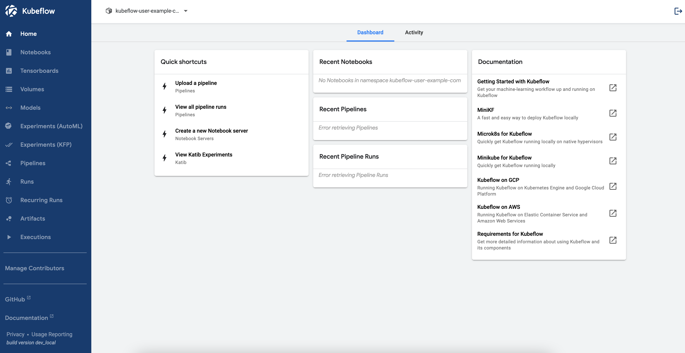
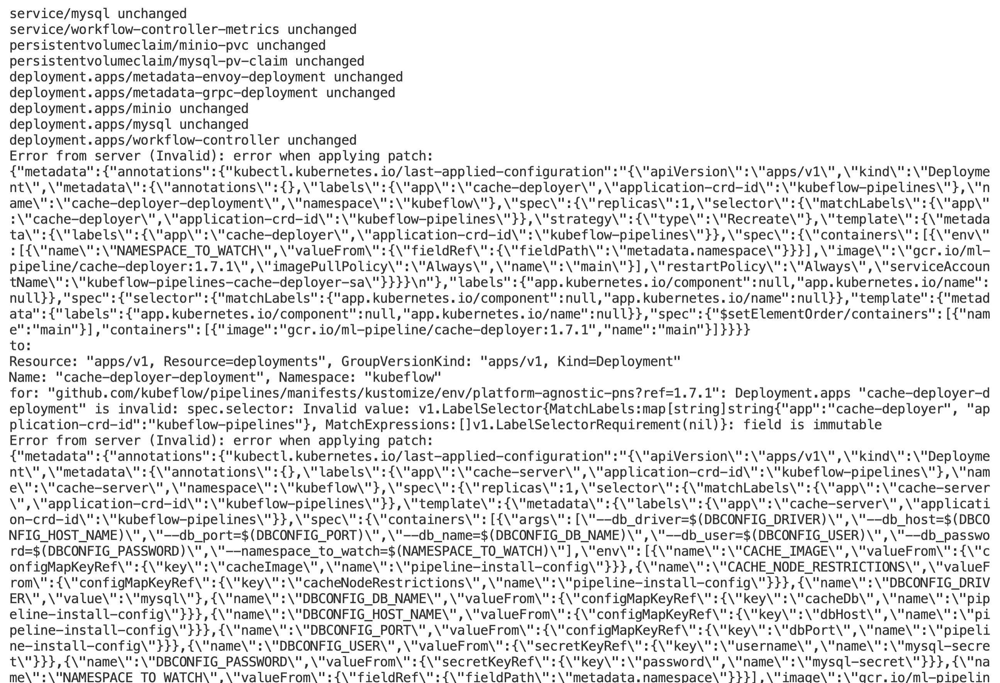
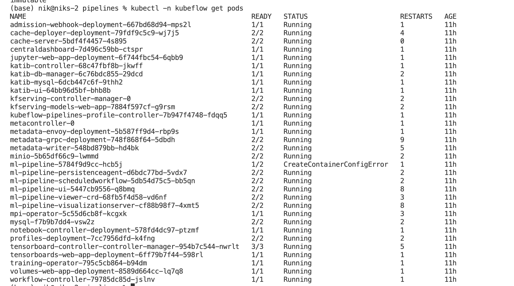
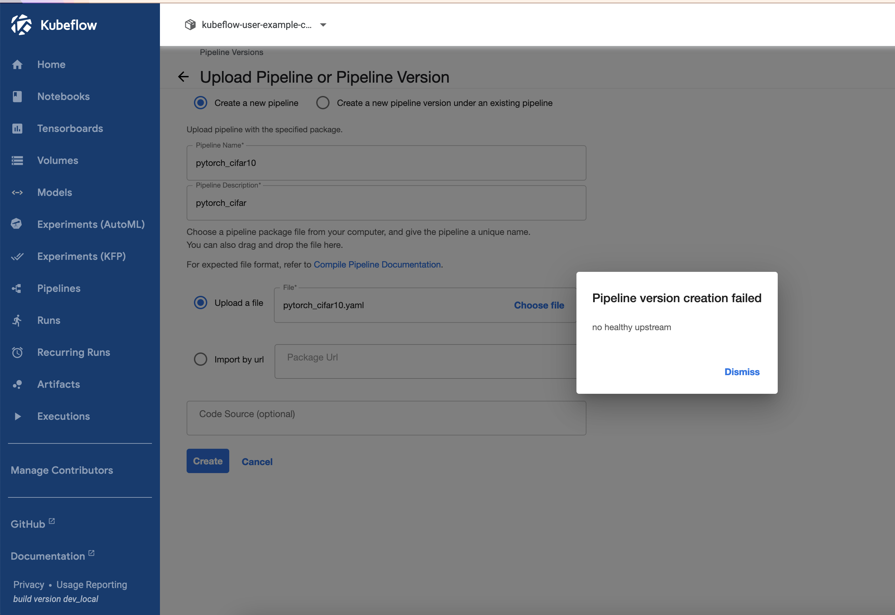

<!-- toc --> 
# MLOPS - Kubeflow Local Deployment
> Mac OS
### Kubeflow Installation Steps


- Start the docker service
- Install Kubectl

- Install Minikube using brew

- Install Kubernetes v1.20.12 as shown in command below
  - minikube start --kubernetes-version=v1.20.12  —memory 12200 —cpus=6

- Install kustomise v 3.2.0 For mac
	
  - mv kustomize_3.2.0_linux_amd64 ~/.local/bin/kustomize kustomize


- After kustomize installation, below command can to install kubeflow

    - while ! kustomize build example | kubectl apply -f -;  do echo "Retrying to apply resources"; sleep 10; done

- Apply secret for deploying and applying test namespace
  - kubectl apply -f mino-secret.yaml -n kubeflow-user-example-com

- Update pipeline configuration using the below commands

- For using Kubeflow service do a port forward at 8080

  - kubectl port-forward svc/istio-ingressgateway -n istio-system 8080:80

- For checking out minio service
  - kubectl port-forward -n kubeflow svc/minio-service 9090:9000

UI Screenshot


## Errors 

- While executing the below command in the pns installation
```
export PIPELINE_VERSION=1.7.1
kubectl apply -k "github.com/kubeflow/pipelines/manifests/kustomize/cluster-scoped-resources?ref=$PIPELINE_VERSION"
kubectl wait --for condition=established --timeout=60s crd/applications.app.k8s.io
kubectl apply -k "github.com/kubeflow/pipelines/manifests/kustomize/env/platform-agnostic-pns?ref=$PIPELINE_VERSION"
```


- This might be impacting the ml-pipeline pods, as mentioned in the screenshot below


And hence

